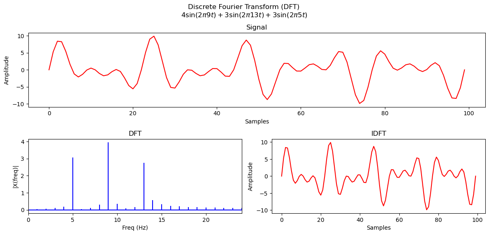

# DFT and IDFT

This Notebook is an simple application of  Discrete Fourer Transform.

It generates a random signal with $\sum_{i=1}^{3}A_i\sin(2\pi f_i t)$;

  $A \in \N [1,5]$ being a random Amplitude ;  $f \in \N [1,20]$ being a random frequency;

